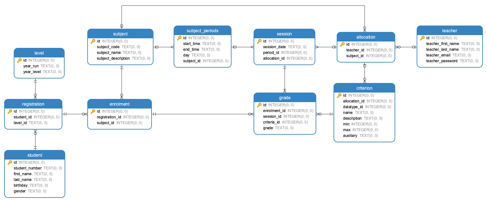

# Student Record Helper

**Heroku App Deployment API Base URL (Demo)**

```
https://student-record-helper-backend.herokuapp.com
```

### Description

**Student Record Helper** is a collaboration project with an objective of helping school teachers conveniently create and manage student records. 

This repository contains the backend REST API code. We are also currently working on a front end React Web App as part of the project, available via

```
https://github.com/juntao-dev/student-record-helper-front
```

[Placeholder - System Design Diagram]

_Note: This project is built upon a previous student project that aims to provide student grading solution to school PE teachers. The original project files remain available at the `original-project` branch._

_Dummy data records are created for testing purposes only. In case you wonder, they are not real. Do not use real personal data when interacting with this API!_

### Tools

This demo project is currently under development. Tools that we are using include: 

- **Framework:** Python Flask
- **Hosting:** Heroku App
- **Data Storage:** SQLite

### Database



### API End Points

---

**API - Get all student records**

```HTTP
GET /get-all-students
```
- **Usage:** Return an array of all student records.

- **Example:**

```JSON
[{
  "birthday": "12/1/2000",
  "first_name": "Christi",
  "gender": "F",
  "id": 1,
  "last_name": "Bella",
  "student_number": "1"
}]
```
---

**API - Get Records of Individual Studdent using Student ID**

```HTTP
GET /get-student-by-id?id=<student id>
```
**Usage:**

**Example:**

---

```HTTP
GET /get-student-by-subject-code?code=<subject code>
```
**Usage:**

**Example:**

---

```HTTP
GET /getsubjectsbystudentid?id=<student id>
```
**Usage:**

**Example:**

---

```HTTP
GET /getsubjectsbyteacherid?id=<teacher id>
```
**Usage:**

**Example:**

---

```HTTP
GET /getcriteriabysubjectid?id=<subject id>
```
**Usage:**

**Example:**